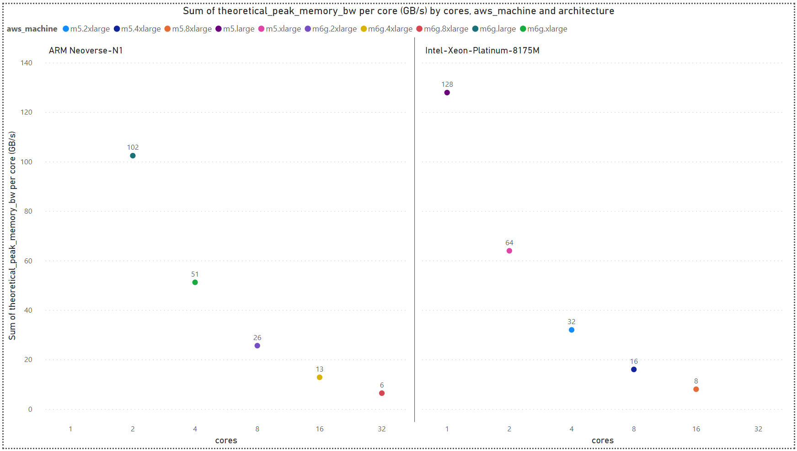

# 3. Analysis
\
<ins>Memory Bandwidth Explained:</ins>\
Memory bandwidth is a crucial metric that measures the rate at which data can be transferred between the CPU and RAM in a computer system. It plays a pivotal role in determining the overall performance and responsiveness of the system. A higher memory bandwidth indicates a faster data transfer rate, allowing the CPU to quickly access and retrieve information stored in RAM. This efficiency is essential for seamless multitasking, handling large datasets, and executing complex computational tasks. Memory bandwidth is influenced by factors such as the design of the memory controller, the number of memory channels, and the speed of the RAM modules. In essence, a well-optimized memory bandwidth ensures smooth communication between the central processing unit and the system memory, contributing significantly to overall computing efficiency.

For example, DDR4 memory modules transfer data on a bus that is 8 bytes (64 data bits) wide.\
Each DDR4 peak transfer rate calculated as follows: `Date Rate (MT/s) * Bus Width (B/T)`.\
In order to get to the theoretical memory BW the peak transfer rate should also be multiplied by the number of memory channels.\
Therefore, a theoretical maximum bandwidth is: `Date Rate (MT/s) * Bus Width (B/T) * #Memory Channels`.

## AWS EC2 Comparison: M5 vs. M6g -
In this work we compared between the M5 and M6g [EC2 instance types](https://aws.amazon.com/ec2/instance-types/).

- <ins>M5 Features:</ins>\
Up to 3.1 GHz Intel Xeon Platinum Scalable processor (Skylake 8175M or Cascade Lake 8259CL) with new Intel Advanced Vector Extension (AVX-512) instruction set.\
Memory channels (total): 6\
Supported memory: DDR4-2666/DDR4-2933 (2666/2933 Date Rate (MT/s) accordingly)

- <ins>M6g Features:</ins>\
Custom built AWS Graviton2 Processor with 64-bit ARM Neoverse-N1 cores.\
Memory channels (total): 8\
Supported memory: DDR4-3200 (3200 Date Rate (MT/s))

Hence, the maximum theoretical memory bandwidth of M6g is 204.8 GB/s, whereas M5 expected to reach up to 127.9 GB/s and 140.7 GB/s for DDR4-2666 and DDR4-2933 accordingly.

More information about Graviton2 can be found [here](https://pages.awscloud.com/rs/112-TZM-766/images/2020_0501-CMP_Slide-Deck.pdf) and [here](https://github.com/aws/aws-graviton-getting-started).\
And more information about Intel Xeon can be found [here](https://www.cpu-world.com/CPUs/Xeon/Intel-Xeon%208175M.html) and [here](https://www.cpu-world.com/CPUs/Xeon/Intel-Xeon%208259CL.html).

> [Back](./benchmarks.md)

> [Next](./stream_analysis.md)
