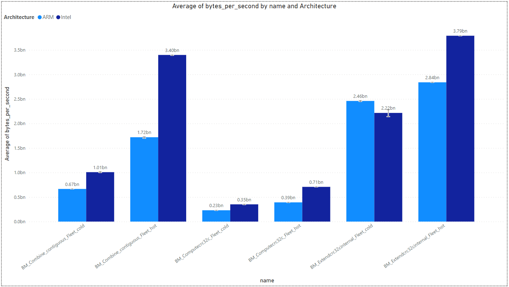
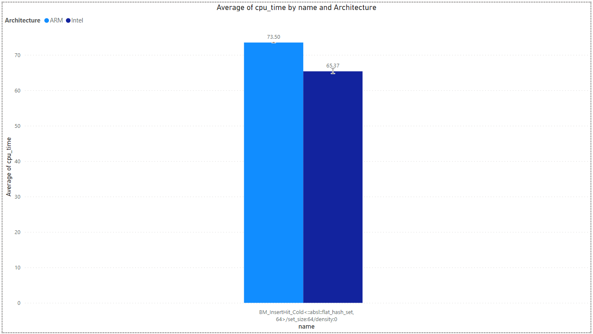

## 3.3. Fleetbench Analysis

As described in [this paper](https://research.google/pubs/pub44271/), a significant portion of compute is spent in code common to many applications - the so-called ‘Data Center Tax’. The components that we included in the tax classification are: protocol buffer management, remote procedure calls (RPCs), hashing, compression, memory allocation and data movement.

### AWS Configurations -

- `Intel machine (32 VCPU):` m5.8xlarge
- `ARM machine (32 VCPU):` m6g.8xlarge
- `Machine disk size (gp2):` 8 GB
- `Region:` us-west-1b
- `Run iterations:` 5

### Analysis -

The analysis is made for the average *cpu_time* in nano seconds, or for the average *bytes_per_second* out of 5 iterations.

#### Compression Benchmark

Covers [Snappy](https://github.com/google/snappy), [ZSTD](https://facebook.github.io/zstd/), [Brotli](https://github.com/google/brotli), and Zlib.

`TODO` - Add graph.

`TODO` - Add explaination.

#### Hashing Benchmark

Supports algorithms: [CRC32](https://github.com/abseil/abseil-cpp/tree/master/absl/crc), [absl::Hash](https://github.com/abseil/abseil-cpp/tree/master/absl/hash).

`TODO` - Add explaination.

#### Mem Benchmark

Supports libc algorithms: Memcpy, Memmove, Memcmp, Bcmp, Memset.

`TODO` - Add explaination.

#### Proto Benchmark

Protocol buffers provide a serialization format for packets of typed, structured data that are up to a few megabytes in size. The format is suitable for both ephemeral network traffic and long-term data storage. Protocol buffers can be extended with new information without invalidating existing data or requiring code to be updated.
Protocol buffers are the most commonly-used data format at Google. They are used extensively in inter-server communications as well as for archival storage of data on disk.
More information can be found [here](https://protobuf.dev/overview/).

`TODO` - Add explaination.

#### Swissmap Benchmark

Swiss tables hold a densely packed array of metadata, containing presence information for entries in the table. This presence information allows us to optimize both lookup and insertion operations. This metadata adds one byte of overhead for every entry in the table.
More information can be found [here](https://abseil.io/blog/20180927-swisstables).

- **Swissmap-hot:**

- **Swissmap-cold:**

`TODO` - Add explaination.

#### Tcmalloc Benchmark

TCMalloc is Google's customized implementation of C's malloc() and C++'s operator new used for memory allocation within our C and C++ code. TCMalloc is a fast, multi-threaded malloc implementation.
More information can be found [here](https://github.com/google/tcmalloc).

`TODO` - Add explaination.

> [Back](./multiload_analysis.html)

> [Next](./conclusions.md)
