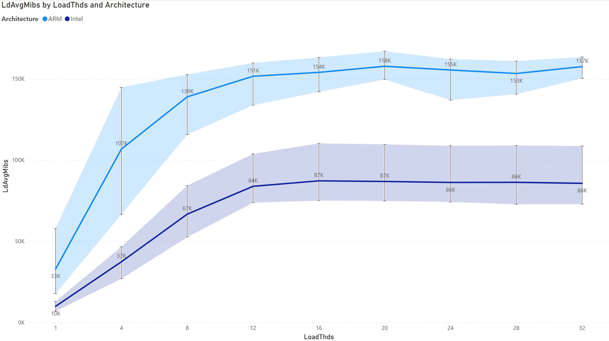

## 3.2. Multiload Analysis

`TODO` - Add explaination.

### LdAvgMibs by LoadThds and Architecture

`TODO` - To emphasize why does this analysis important.

#### AWS Configurations -

- `Intel machine (32 VCPU):` m5.8xlarge
- `ARM machine (32 VCPU):` m6g.8xlarge
- `AWS region:` us-west-2
- `Run iterations:` 3

#### Analysis -

- **Comparison:**

`TODO` - Add explaination.

> [Back](./sysbench_analysis.html)

> [Next](./fleetbench_analysis.md)
