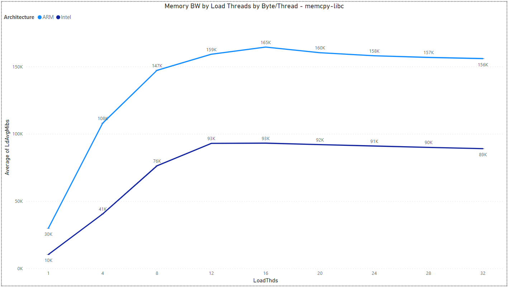
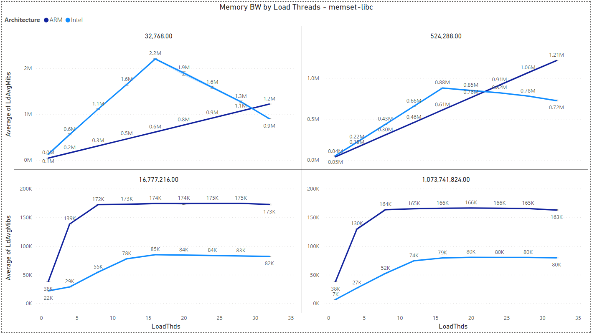
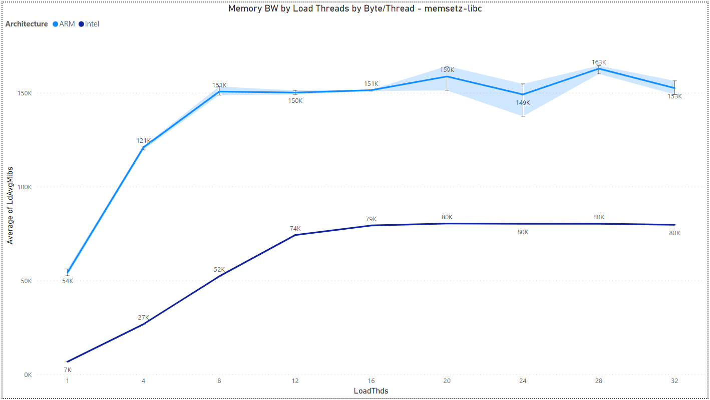
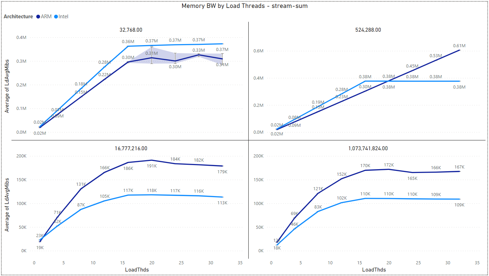
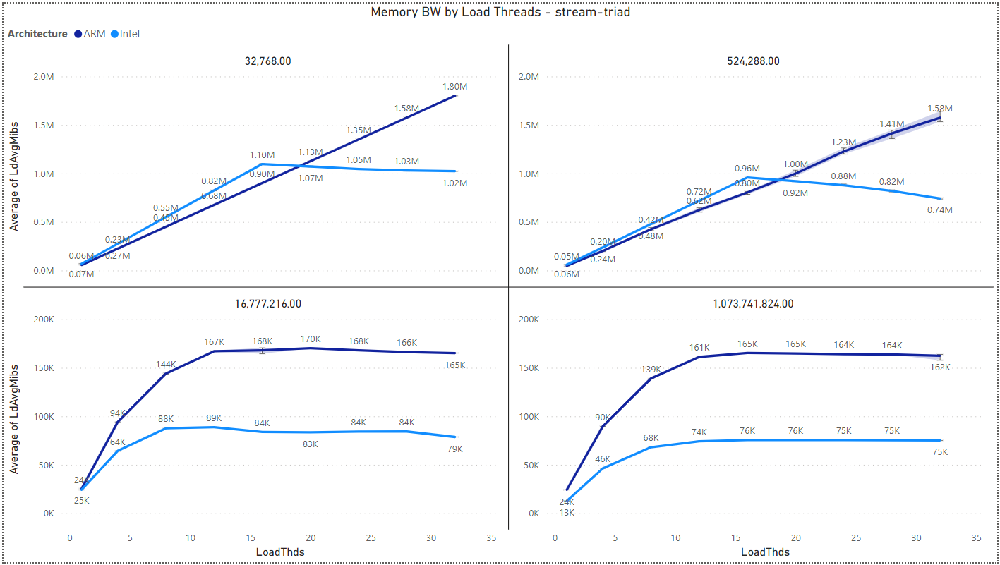

## 3.2. Multiload Analysis

Multichase - a pointer chaser benchmark.\
Multiload - a superset of multichase which runs latency, memory bandwidth, and loaded-latency.

### AWS Configurations -

- `Intel machine (32 VCPU):` m5.8xlarge
- `ARM machine (32 VCPU):` m6g.8xlarge
- `Machine disk size (gp2):` 8 GB
- `AWS region:` us-west-1b
- `Run iterations:` 5

### Analysis -

Analyzing the latency and bandwidth effects of the machines we employed is crucial for gaining a deeper insight into the impediments that hinder the enhancement of their performance.

#### Multichase: Memory Read Latency by Byte/Thread and Architecture

In this benchmark the Multichase "simple" test is running, in which a single thread with variable amount of bytes compute, and measured is the average of ChaseNS (Multichase nano seconds <=> latency) out of 5 iterations.

#### Multiload: Memory BW by Load Threads and Architecture

The results are for Byte/Thread = 1,073,741,824.

- **memcpy-libc:**
1:1 rd:wr ratio - glibc memcpy()

- **memset-libc:**
0:1 rd:wr ratio - glibc memset() non-zero data

- **memsetz-libc:**
0:1 rd:wr ratio - glibc memset() zero data

- **stream-sum:**
1:0 rd:wr ratio - lmbench stream sum instructions: s+=a[i] (actual binary depends on compiler & -O level)

- **stream-triad:**
2:1 rd:wr ratio - lmbench stream triad instructions: a[i]=b[i]+(scalar*c[i])

> [Back](./stream_analysis.md)

> [Next](./sysbench_analysis.md)
