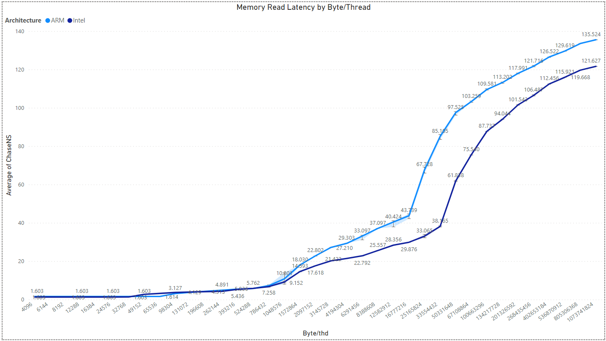
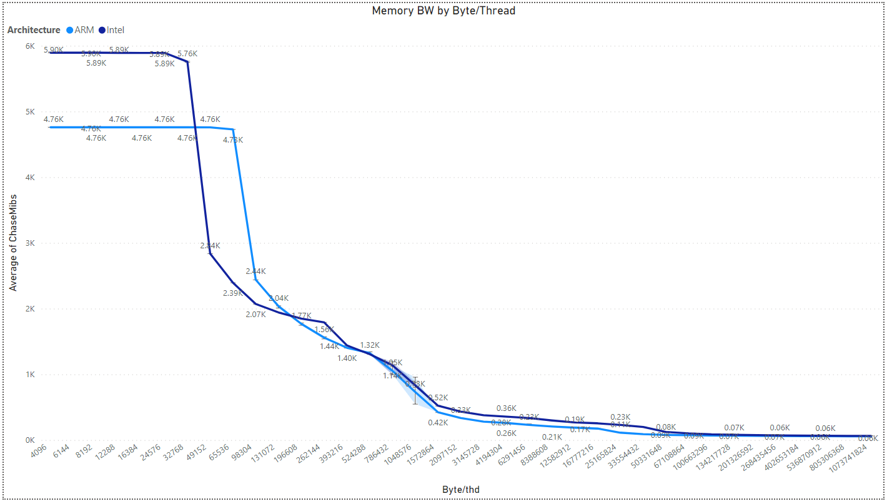
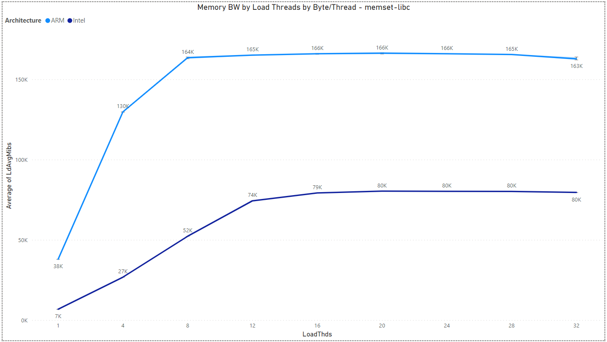
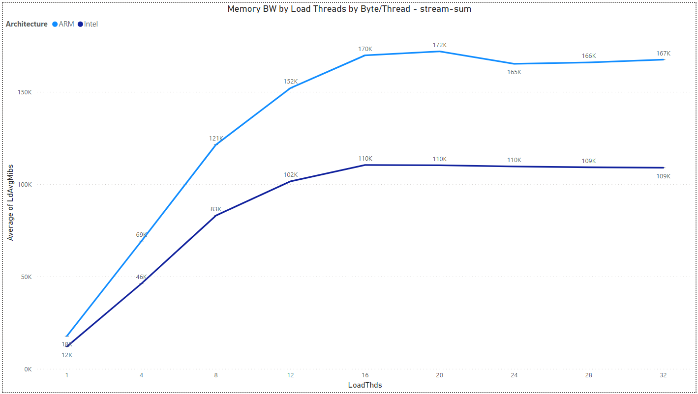
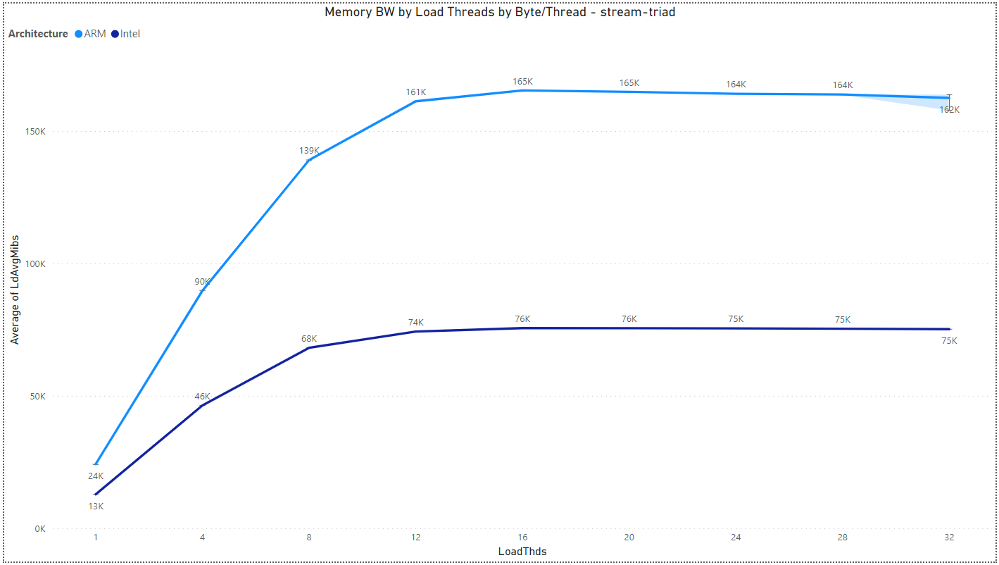

## 3.2. Multiload Analysis

Multichase - a pointer chaser benchmark.\
Multiload - a superset of multichase which runs latency, memory bandwidth, and loaded-latency.

### AWS Configurations -

- `Intel machine (32 VCPU):` m5.8xlarge
- `ARM machine (32 VCPU):` m6g.8xlarge
- `Machine disk size (gp2):` 8 GB
- `AWS region:` us-west-1b
- `Run iterations:` 5

### Analysis -

Analyzing the latency and bandwidth effects of the machines we employed is crucial for gaining a deeper insight into the impediments that hinder the enhancement of their performance.

#### Multichase: Memory Read Latency by Byte/Thread and Architecture

In this benchmark the Multichase "simple" test is running, in which a single thread with variable amount of bytes compute, and measured is the average of ChaseNS (Multichase nano seconds <=> latency) out of 5 iterations.

#### Multichase: Memory BW by Byte/Thread and Architecture

In this benchmark the Multichase "simple" test is running, in which a single thread with variable amount of bytes compute, and measured is the average of ChaseMibs (Multichase mebibytes per second <=> memory bandwidth) out of 5 iterations.

#### Multiload: Memory BW by Load Threads and Architecture

***memcpy-libc:***

1:1 rd:wr ratio - glibc memcpy()

`TODO` - Add explaination.

***memset-libc:***

0:1 rd:wr ratio - glibc memset() non-zero data

`TODO` - Add explaination.

***memsetz-libc:***

0:1 rd:wr ratio - glibc memset() zero data

`TODO` - Add explaination.

***stream-sum:***

1:0 rd:wr ratio - lmbench stream sum instructions: a[i]+=1   (actual binary depends on compiler & -O level)

`TODO` - Add explaination.

***stream-triad:***

2:1 rd:wr ratio - lmbench stream triad instructions: a[i]=b[i]+(scalar*c[i])

`TODO` - Add explaination.

> [Back](./sysbench_analysis.html)

> [Next](./fleetbench_analysis.md)
