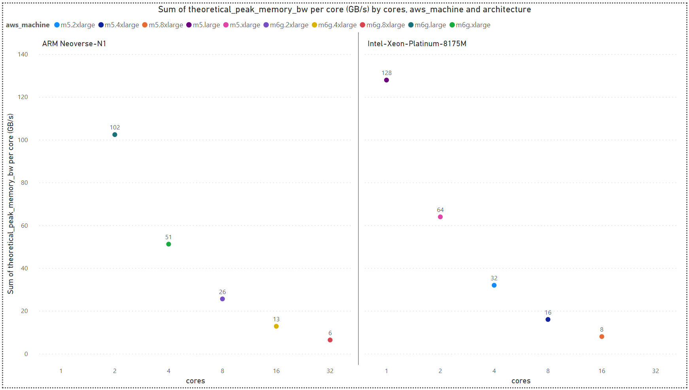
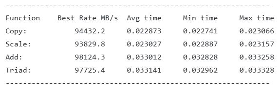
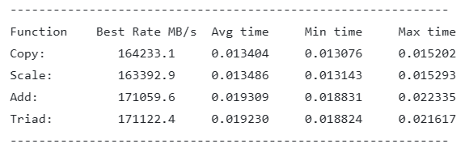

# 3. Analysis

## AWS EC2 Comparison: M5 vs. M6g -
In this work we compared between the M5 and M6g [EC2 instance types](https://aws.amazon.com/ec2/instance-types/).

- <ins>M5 Features:</ins>\
Up to 3.1 GHz Intel Xeon Scalable processor (Skylake 8175M or Cascade Lake 8259CL) with new Intel Advanced Vector Extension (AVX-512) instruction set.\
Memory channels (total): 6\
Supported memory: DDR4-2666/DDR4-2933 (2666/2933 Date Rate (MT/s) accordingly)

- <ins>M6g Features:</ins>\
Custom built AWS Graviton2 Processor with 64-bit Arm Neoverse cores.\
Memory channels (total): 8\
Supported memory: DDR4-3200 (3200 Date Rate (MT/s))

<ins>The maximum theoretical bandwidth is expected to be as follows:</ins>\
DDR4 memory modules transfer data on a bus that is 8 bytes (64 data bits) wide.\
Each DDR4 peak transfer rate calculated as follows: `Date Rate (MT/s) * Bus Width (B/T)`.\
In order to get to the theoretical memory BW the peak transfer rate should also be multiplied by the number of memory channels.\
Hence, the maximum theoretical bandwidth of M6g is 204.8 GB/s, whereas M5 expected to reach 127.9 GB/s and 140.7 GB/s for DDR4-2666 and DDR4-2933 accordingly.

More information about Graviton2 can be found [here](https://pages.awscloud.com/rs/112-TZM-766/images/2020_0501-CMP_Slide-Deck.pdf) and [here](https://github.com/aws/aws-graviton-getting-started).\
And more information about Intel Xeon can be found [here](https://www.cpu-world.com/CPUs/Xeon/Intel-Xeon%208175M.html) and [here](https://www.cpu-world.com/CPUs/Xeon/Intel-Xeon%208259CL.html).

## 3.1. Stream Analysis

STREAM is a simple, synthetic benchmark designed to measure sustainable memory bandwidth (in MB/s) for four simple vector kernels: Copy, Scale, Add and Triad.

### AWS Configurations -

- `Intel machine (32 VCPU):` m5.8xlarge
- `ARM machine (32 VCPU):` m6g.8xlarge

### Analysis -

#### Stream Memory Bandwidth

- **Intel-Xeon-Platinum-8175M Results:**

As we can see the peak memory bandwidth is ~76% of the theoretical value presented above.

- **ARM Neoverse-N1 Results:**

As we can see the peak memory bandwidth is ~83% of the theoretical value presented above.

- **Comparison:**

ARM Neoverse-N1 (AWS machine m6g.8xlarge) has 60% improved peak theoretical memory bandwidth compared to Intel-Xeon-Platinum-8175M (AWS machine m5.8xlarge),
and running the stream benchmark we see Neoverse-N1 can reach even ~74% improvement in peak memory bandwidth in practice.

> [Back](./benchmarks.md)

> [Next](./sysbench_analysis.md)
