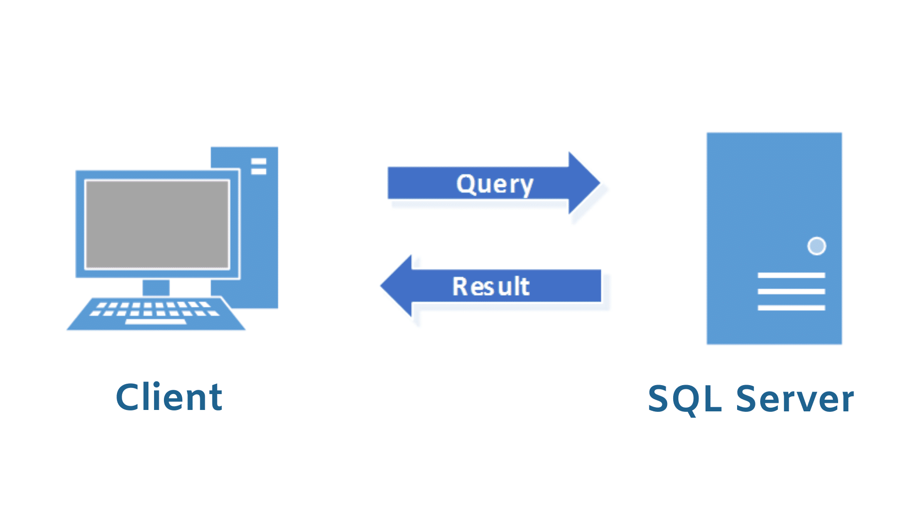
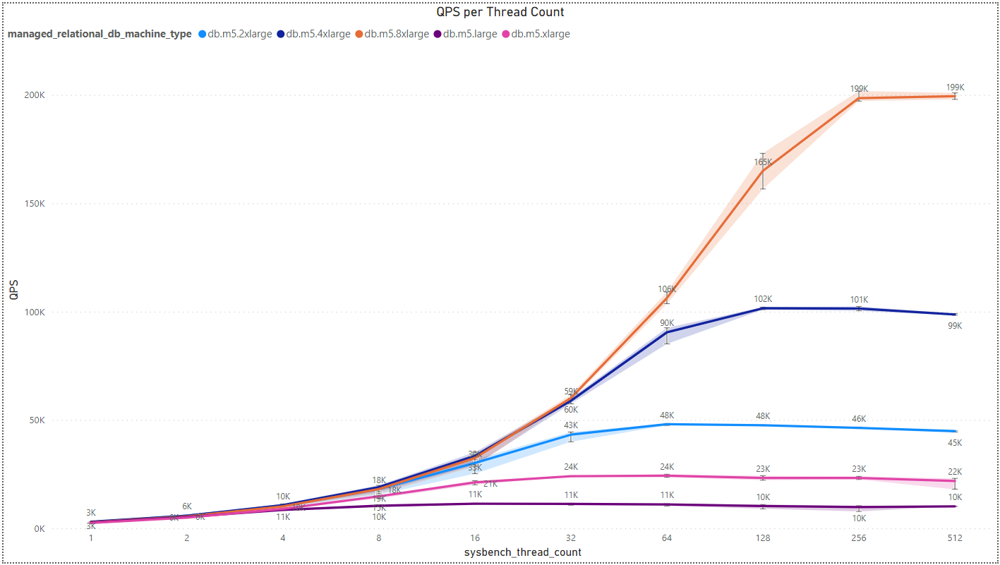
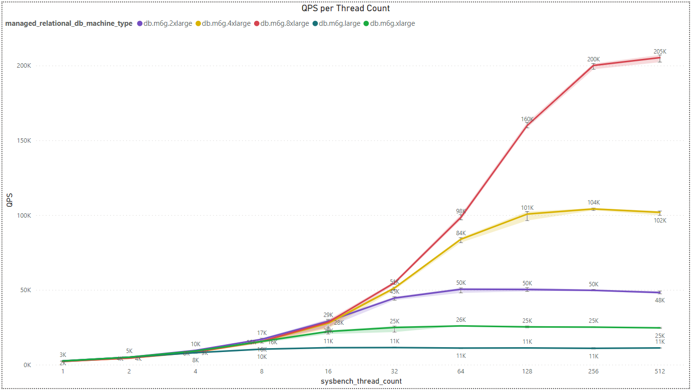
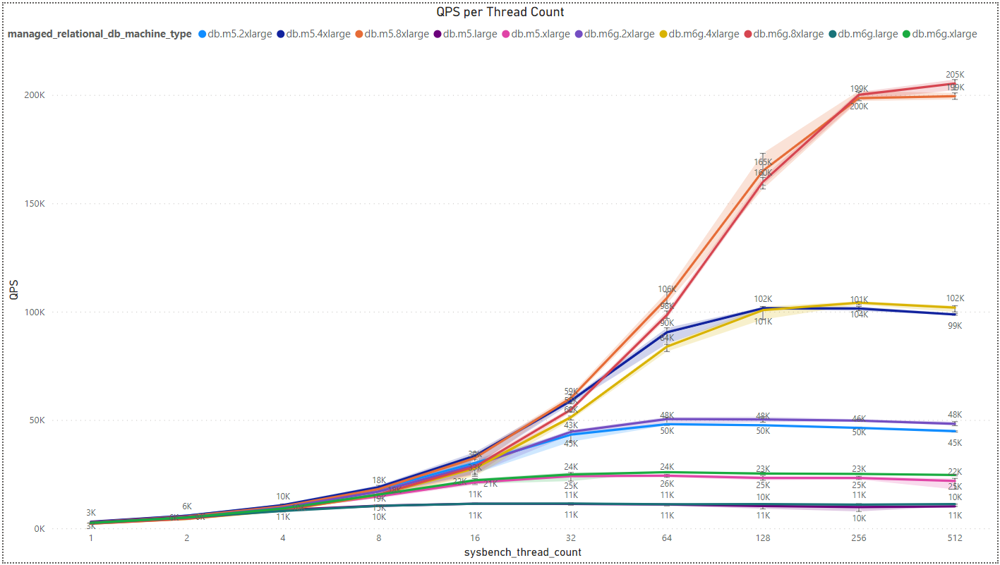

## 3.3. Sysbench Analysis

Sysbench OLTP (Online Transaction Processing) benchmark is a popular tool used to evaluate the performance of database systems by simulating a workload typical of an OLTP application. OLTP systems are designed to handle a large number of short, fast transactions, such as those encountered in a banking or e-commerce application.

The threads flag in Sysbench allows you to specify the number of threads that will be used to execute the OLTP benchmark. Threads are independent sequences of instructions that can be scheduled to run by the operating system. In the context of Sysbench OLTP benchmark, each thread simulates a separate client connection to the database server.

### AWS Configurations -

- `Database machine - Intel (2/4/8/16/32 VCPU):` db.m5.large/db.m5.xlarge/db.m5.2xlarge/db.m5.4xlarge/db.m5.8xlarge
- `Database machine - ARM (2/4/8/16/32 VCPU):` db.m6g.large/db.m6g.xlarge/db.m6g.2xlarge/db.m6g.4xlarge/db.m6g.8xlarge
- `Client machine - Intel (32 VCPU):` m5.8xlarge
- `Database disk size (gp2):` 500 GB
- `Client disk size (gp2):` 300 GB
- `Region:` us-west-1b
- `Run iterations:` 5
- `Sysbench run threads:` 1,2,4,8,16,32,64,128,256,512

### Analysis -

#### QPS per Thread Count and Architecture

- **Intel Architecture Results:**

- **ARM Architecture Results:**

- **Comparison:**

We've observed an intriguing trend where there isn't a significant difference in results among various manufacturers. Nevertheless, Intel appears to have a slight advantage when dealing with a small to medium number of threads. However, as the thread count increases, this advantage diminishes to the point where ARM overtakes Intel in performance for each pair of processors with the same vCPU count. 

Another noteworthy detail is that processors with more power, i.e., a higher core/vCPU count, exhibit an intersection point in QPS between pairs of processors at a higher thread count. For instance, when considering processors with 32 vCPUs, specifically db.m5.8xlarge for Intel and db.m6g.8xlarge for ARM, the crossover point occurs at around 256 threads. In contrast, for processors with 16 vCPUs, the crossover point emerges at approximately 128 threads. Beyond these points, the performance advantage shifts in favor of ARM, as previously explained.

It's essential to highlight that the way measurements are configured has a significant impact on the outcomes. This includes factors such as the timing of the measurements, the sizes of the chosen disks, the geographical region of the server, and more. Consequently, it's advisable to interpret these results with a degree of caution. Anyone interested in this study can replicate the experiments, generate graphs, make comparisons, or reach out to me directly for additional information.

> [Back](./multiload_analysis.md)

> [Next](./fleetbench_analysis.md)
