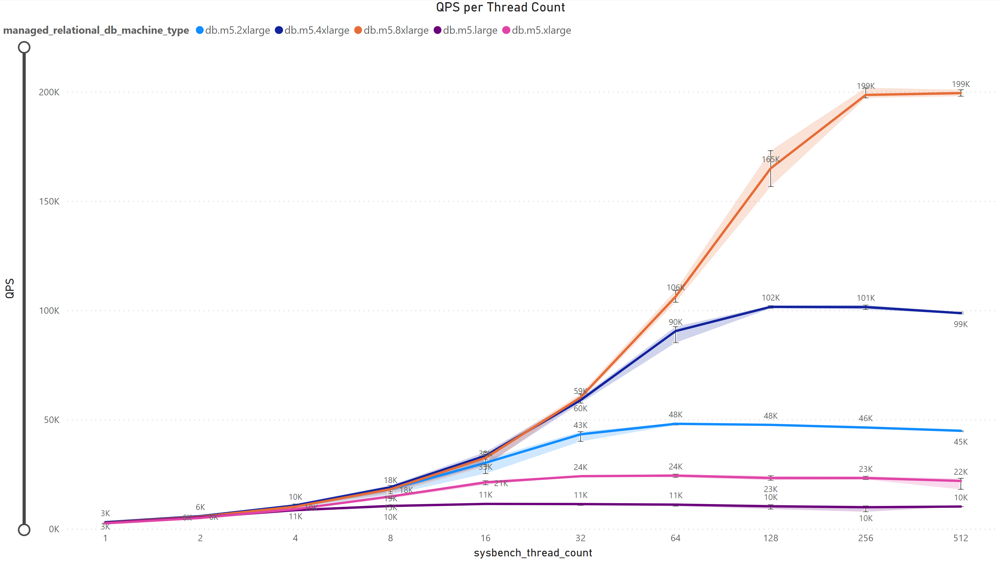
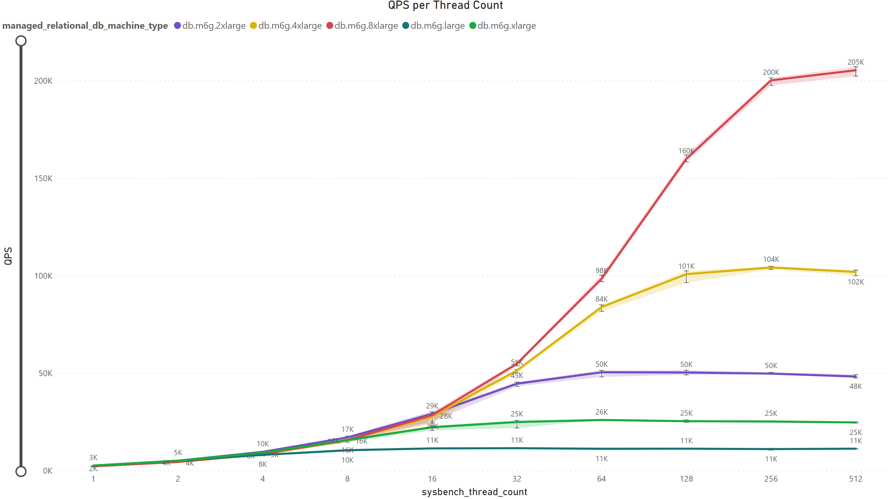
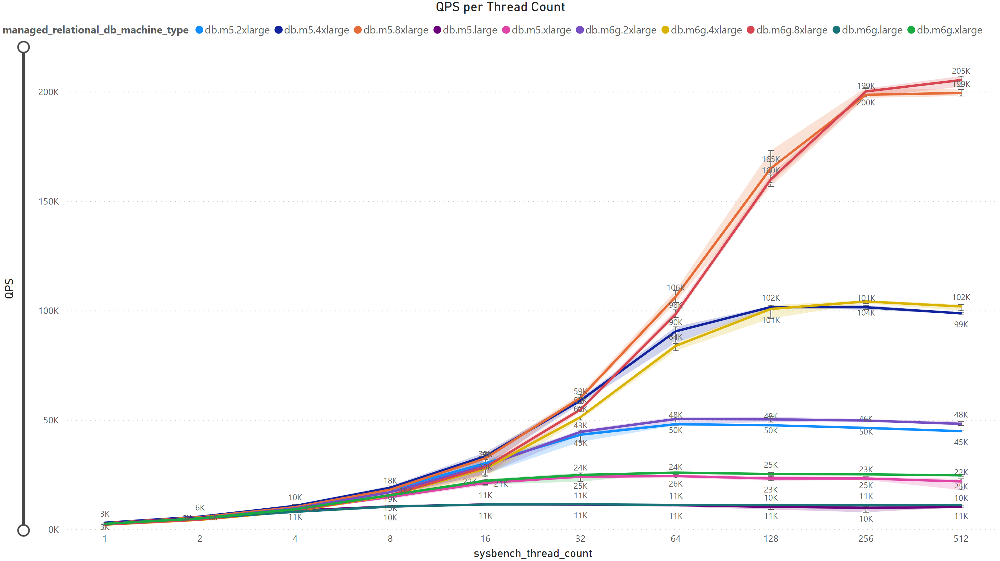

## 3.1. Sysbench Analysis

`TODO` - Add explaination about the benchmark flags I used, etc. sysbench_threads_count/run_threads, explain how they work. and and in general about qps and what we expect, and the client-server relationship.

### QPS per Thread Count

`TODO` - To emphasize why does this analysis important.

#### The Experimental Constants -

`TODO` - In the experimant there are multiple of factors that can influence the results, therefore this is how we took care of that:
- `Database Machine Type:` The Intel and ARM families of processors are very close to having the same parameters, +names+parameters.
- `Networking:` In order to avoide variatios caused by network between multiple different clients and servers from different architectures we chose to have the clients and the database machines at the same AWS region, and specifically also at the same availability zone.
- `Client Machine Type:`In the experiment we are interested in the DB machine preformance, therefore the client is a strong 32 vCPU client, tentitively chosen to be of Intel architecture, but need to also check with ARM 32 vCPU client machine for both as well.
- `Disk Size:` Both the DB and client disk size where tentatively chosen and are constant at all time. But worth checking the influence of that parameter as well.
- `Iterations:` We would much prefer to have larger number of iterations to conclued from but the scope of the experiment is limited and takes long time to produce the results currently.

#### AWS Configurations -

- `Database machine - Intel (2/4/8/16/32 VCPU):` db.m5.large/db.m5.xlarge/db.m5.2xlarge/db.m5.4xlarge/db.m5.8xlarge
- `Database machine - ARM (2/4/8/16/32 VCPU):` db.m6g.large/db.m6g.xlarge/db.m6g.2xlarge/db.m6g.4xlarge/db.m6g.8xlarge
- `Client machine - Intel (32 VCPU):` m5.8xlarge
- `Database disk size (gp2):` 500 GB
- `Client disk size (gp2):` 300 GB
- `Region:` us-west-1b
- `Run iterations:` 5
- `Sysbench run threads:` 1,2,4,8,16,32,64,128,256,512

#### Analysis -

- **Intel Architecture Results:**

`TODO` - Add explaination about that the more the thread count increases also the qps until the increase becomes smaller and smaller. And also processors with more cores/vCPU produce higher qps. And to talk about the ratios. Also to add theoretical reasons for that so later we could examine them. And to think why it makes sense.

- **ARM Architecture Results:**

`TODO` - The same.

- **Comparison:**

`TODO` - Add line of the theoretical line of multiplying the qps for multiplyied number of threads.  

We've observed an intriguing trend where there isn't a significant difference in results among various manufacturers. Nevertheless, Intel appears to have a slight advantage when dealing with a small to medium number of threads. However, as the thread count increases, this advantage diminishes to the point where ARM overtakes Intel in performance for each pair of processors with the same vCPU count. 

Another noteworthy detail is that processors with more power, i.e., a higher core/vCPU count, exhibit an intersection point in QPS between pairs of processors at a higher thread count. For instance, when considering processors with 32 vCPUs, specifically db.m5.8xlarge for Intel and db.m6g.8xlarge for ARM, the crossover point occurs at around 256 threads. In contrast, for processors with 16 vCPUs, the crossover point emerges at approximately 128 threads. Beyond these points, the performance advantage shifts in favor of ARM, as previously explained.

It's essential to highlight that the way measurements are configured has a significant impact on the outcomes. This includes factors such as the timing of the measurements, the sizes of the chosen disks, the geographical region of the server, and more. Consequently, it's advisable to interpret these results with a degree of caution. Anyone interested in this study can replicate the experiments, generate graphs, make comparisons, or reach out to me directly for additional information.

Looking ahead, our future plans involve investigating how these parameters influence the results and presenting a performance-to-cost index.

#### Theoretical Questions -
`TODO` - Add
- What if we worked in another region?
- What if we had 32 vCPU ARM client?
- What if we ran more iterations?
- What if we would have used different disk sizes?
- What is the influence of the memory BW to it?
- What is the influence of the network to it?
- What if we ran this experiment on a different cloud provider, or even locally?

> [Back](./benchmarks.html)

> [Next](./multiload_analysis.md)
